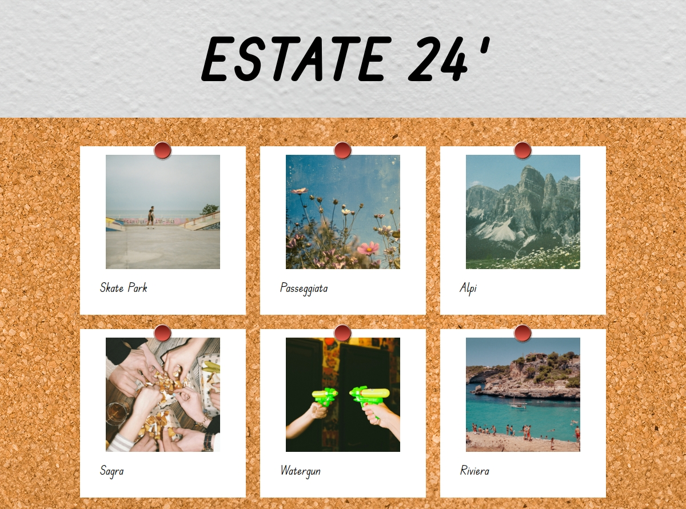
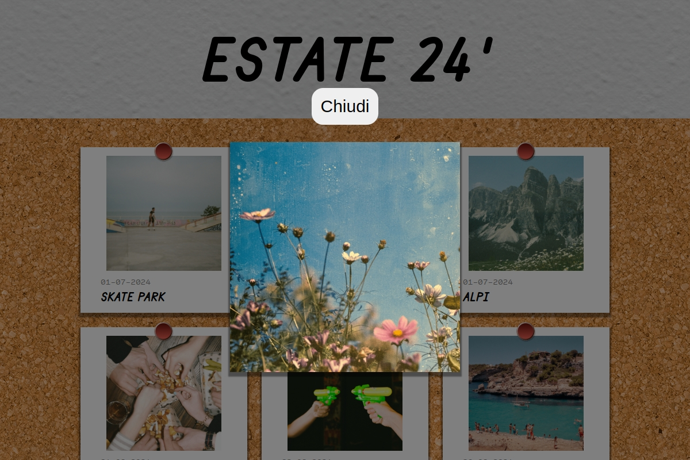

# JS PHOTO BLOG

## Info

In questa esercitazione, salvata ome progetto n.31 classe Boolean 142, dobbiamo realizzare una pagina web nella totalità di due giorni.
Il progetto è stato diviso in milestones da conseguire. Qui di seguito tutte le info.

## GIORNO 1
In questa pagina verranno visualizzate delle foto (e tutte le informazioni relative ad esse), importate tramite una chiamata AJAX all'interno del nostro file Javscript.

### Milestone 1 
Come primo obiettivo abbiamo il compito di creare la pagina Web, utilizzando solamente HTML e CSS. Come riferimento abbiamo degli screenshot, che troverete nella cartella immagini.

### Milestone 2
Lavorando con Postman si inizia a vedere il funzionamento dell'API fornita e prendere atto di come i dati sono stati raccolti all'interno di essa, per andare poi a chiamarli e visualizzarli nel nostro progetto.

### Milestone 3

La Milestone 3 si concentra prettamente su Javascript. Bisogna effettuare una chiamata Ajax all'API, in modo da raccogliere i dati relativi alle foto (foto comprese) e pubblicarle in pagina sfruttando l'API del DOM.

### Bonus
Il bonus consiste nel rendere la pagina responsive. Il progetto è stato iniziato in modalità desktop quindi la responsività per la versione Tablet e la versione Mobile verranno trattate di conseguenza.
_______
#### Layot Desktop Giorno 1:

## GIORNO 2
L'obiettivo del giorno 2 è creare un overlay che blocchi l'interazione con la pagina e nel quale venga visualizzata una delle foto. Nell'overlay ci sarà anche un bottone che permetterà di disattivare l'overlay stesso. Inoltre ogni volta che cliccheremo su una delle foto presenti in pagina si riattiverà l'overlay con la foto cliccata.

### Milestone 1 
Come primo obiettivo bisogna creare l'overlay nel quale viene visualizzata un'immagine a nostra scelta di quelle presenti in pagina. Io ho scelto la prima immagine. Inseriammo anche un bottone di chiusura

### Milestone 2
Lavoriamo con il bottone di chiusura, in modo che permetta di disattivare l'overlay. Inoltre cliccando su un'immagine viene riattivato l'overlay, richiudibile sempre tramite lo stesso bottone.

### Milestone 3

Nell'ultima milestone bisogna fare in modo che quando viene riattivato l'overlay, cliccando su un immagine, sia proprio l'immagine cliccata ad essere visualizzata all'interno dell'overlay. Questo l'ho reso possibile lavorando sull'indice della node list conenente le immagini, e sull'indice dell'array di oggetti importato tramite API (l'array contenente gli oggetti corrispondenti alle immagini, con le date, i titolli e i relativi path).

### Bonus
Il bonus consiste nell'attivare un effetto in hover sulle immagini. Quando il mouse va sopra l'immagine viene ruotata di 10 gradi in senso orario e la puntina da disegno viene rimossa. Inoltre il cursore diventa di tipo pointer, in modo da far capire all'utente che quell'elemento sia cliccabile.
_____________

#### Layot Desktop Giorno 2:

### Link Utili

Qui di seguito si trovano gli argomenti utili per la realizzazione di questo progetto:

[Axios](https://axios-http.com/es/docs/intro)  
____
[AJAX](https://developer.mozilla.org/en-US/docs/Glossary/AJAX)  
_____________________
[POSTMAN](https://www.postman.com/)  
__________
[DOM](https://developer.mozilla.org/en-US/docs/Web/API/Document_Object_Model)

