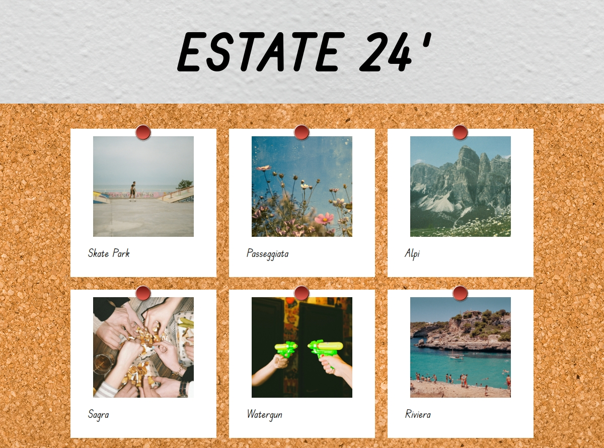

# JS PHOTO BLOG

## Info

In questa esercitazione, salvata ome progetto n.31 classe Boolean 142, dobbiamo realizzare una pagina web nella totalità di due giorni.
Il progetto è stato diviso in milestones da conseguire. Qui di seguito tutte le info.

## GIORNO 1
In questa pagina verranno visualizzate delle foto (e tutte le informazioni relative ad esse), importate tramite una chiamata AJAX all'interno del nostro file Javscript.

### Milestone 1 
Come primo obiettivo abbiamo il compito di creare la pagina Web, utilizzando solamente HTML e CSS. Come riferimento abbiamo degli screenshot, che troverete nella cartella immagini.

### Milestone 2
Lavorando con Postman si inizia a vedere il funzionamento dell'API fornita e prendere atto di come i dati sono stati raccolti all'interno di essa, per andare poi a chiamarli e visualizzarli nel nostro progetto.

### Milestone 3

La Milestone 3 si concentra prettamente su Javascript. Bisogna effettuare una chiamata Ajax all'API, in modo da raccogliere i dati relativi alle foto (foto comprese) e pubblicarle in pagina sfruttando l'API del DOM.

### Bonus
Il bonus consiste nel rendere la pagina responsive. Il progetto è stato iniziato in modalità desktop quindi la responsività per la versione Tablet e la versione Mobile verranno trattate di conseguenza.

### LAYOUT

Ecco qui il layout in versione Desktop:

### Link Utili

Qui di seguito si trovano dei link utili per la realizzazione di questo progetto.

[Axios](https://axios-http.com/es/docs/intro)  
[AJAX](https://developer.mozilla.org/en-US/docs/Glossary/AJAX)  
[POSTMAN](https://www.postman.com/)  
[DOM](https://developer.mozilla.org/en-US/docs/Web/API/Document_Object_Model)

